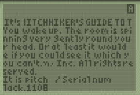

# tyzzy

A TI 83/84 Plus Z-Machine Interpreter. Based on [the TI C project template](https://github.com/empathicqubit/ti8xp-c-template).

It doesn't work yet! The game (HHGG) is set up and it prints text and stops at the first prompt.

